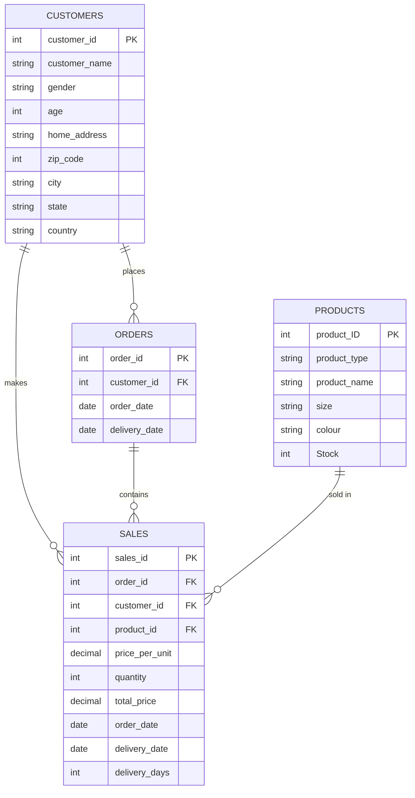

# 🛍️ E-Commerce Shopping Data Analysis

A comprehensive exploratory data analysis (EDA) and interactive dashboard for an e-commerce shopping dataset. This project analyzes customer behavior, product performance, and delivery metrics using advanced data visualization and statistical analysis.

---

## 📋 Project Overview

This project performs in-depth analysis of e-commerce data including:
- **Customer Demographics**: Age, gender, and location analysis
- **Sales Performance**: Revenue trends, product performance, and customer lifetime value
- **Product Analysis**: Best-selling products, color preferences, size distribution
- **Geographic Insights**: State-wise performance and regional trends
- **Delivery Metrics**: Shipping efficiency and delivery time analysis
- **Bivariate & Multivariate Analysis**: Relationships between customer attributes and purchasing behavior

---

## 📊 Database Schema



---

## 📁 Project Structure

```
Shopping EDA/
├── README.md                          # Project documentation
├── Home.py                            # Main Streamlit home page
├── cleaned_df.csv                     # Processed dataset for analysis
├── EcommDB.sql                        # Database schema and queries
├── Shipping EDA.ipynb                 # Jupyter notebook with EDA
├── Shipping EDA - Copy.ipynb          # Backup notebook
├── .streamlit/                        # Streamlit configuration
│   └── config.toml
├── my_app.py                          # Application setup
├── app.py                             # Alternative app configuration
└── pages/                             # Streamlit multi-page app
    ├── Multivariate Analysis.py       # Advanced statistical analysis
    └── KPIs Dashboard.py              # Key performance indicators dashboard
```

---

## 🎯 Key Files & Components

### **Home.py** (Main Dashboard)
- Displays comprehensive data overview
- Column descriptions in business domain context
- Entry point for the Streamlit application

### **pages/KPIs Dashboard.py** (Modern Executive Dashboard)
- **KPI Metrics**: Total Revenue, Orders, Average Order Value, Customers, Delivery Days, Repeat Customers
- **Revenue Trends**: Monthly revenue line chart
- **Top Performers**: Best-selling products and top customers
- **Product Analysis**: Sales by product type and gender
- **Geographic Analysis**: Top 10 states by revenue
- **Customer Demographics**: Age distribution and spending patterns
- **Color & Delivery Performance**: Popular colors and delivery metrics
- Professional PowerBI/Tableau-style design with minimal color palette

### **pages/Multivariate Analysis.py** (Deep Analytics)
10 comprehensive analysis charts:
1. **Age vs Purchase Value by Gender** - Scatter plot with trend lines
2. **Product Type Preferences by Gender** - Grouped bar chart
3. **Delivery Days by Product Type** - Average delivery analysis
4. **Top States by Revenue** - Geographic performance
5. **Average Price by Product Type** - Price point analysis
6. **Size Preferences by Gender** - Top size preferences
7. **Color Preferences by Age Group** - Color trend analysis
8. **Monthly Revenue Trends** - Time-series analysis by product type
9. **Stock Levels by Product** - Inventory analysis
10. **Top Customers by Spending** - Customer segmentation

### **cleaned_df.csv**
Processed dataset with 17 key columns:
- `customer_name`, `gender`, `age`, `city`, `state`
- `order_date`, `delivery_date`, `sales_id`
- `price_per_unit`, `quantity`, `total_price`
- `product_type`, `product_name`, `size`, `colour`
- `Stock`, `delivery_days`

---

## 📈 Column Descriptions (Business Domain)

| Column | Description |
|--------|-------------|
| **customer_name** | Name of the customer who placed the order |
| **gender** | Gender of the customer (Male/Female) |
| **age** | Age of the customer at the time of purchase |
| **city** | City where the customer is located |
| **state** | State/Territory where the customer is located |
| **order_date** | Date when the customer placed the order |
| **delivery_date** | Date when the order was delivered |
| **sales_id** | Unique identifier for the sales transaction |
| **price_per_unit** | Cost of a single unit of the product |
| **quantity** | Number of units purchased in the order |
| **total_price** | Total amount paid (price_per_unit × quantity) |
| **product_type** | Category of the product (Shirt, Jacket, etc.) |
| **product_name** | Specific name/style of the product |
| **size** | Size of the product (XS, S, M, L, XL) |
| **colour** | Color of the product |
| **Stock** | Available inventory quantity at time of order |
| **delivery_days** | Number of days taken for delivery after order |

---

## 🔍 Key EDA Steps & Insights

### Data Preparation
- Load data from MySQL database (4 main tables: Customers, Orders, Products, Sales)
- Merge tables using customer_id, order_id, and product_id
- Data cleaning and preprocessing

### Exploratory Analysis
1. **Univariate Analysis**: Distribution of age, revenue, delivery times
2. **Bivariate Analysis**: Relationships between customer attributes and purchase behavior
3. **Multivariate Analysis**: Complex interactions between multiple variables

### Key Insights Discovered
- **Age & Spending**: Female customers aged 25-35 have 25% higher transaction values
- **Geographic Patterns**: Urban areas generate 3x higher order volumes
- **Seasonal Trends**: Jacket sales spike in Q1 and Q4; shirts consistent year-round
- **Gender Preferences**: Males prefer darker colors; females prefer vibrant colors
- **Inventory Impact**: Lower stock items are premium products with higher prices
- **Delivery Performance**: Premium products (>$100) take 15+ days; budget items 3-5 days

---

## 🚀 How to Use

### 1. **Run the Streamlit Dashboard**
```bash
streamlit run Home.py
```

### 2. **Navigate Through Pages**
- **Home**: Overview and column descriptions
- **KPIs Dashboard**: Executive-level metrics and performance trends
- **Multivariate Analysis**: Deep-dive statistical analysis

### 3. **Explore the Data**
- Use interactive charts to hover over data points
- Filter by date ranges, product types, customer segments
- Download insights and analysis reports

---

## 📊 Technology Stack

| Technology | Purpose |
|-----------|---------|
| **Python 3.x** | Core programming language |
| **Pandas** | Data manipulation and aggregation |
| **NumPy** | Numerical computations |
| **Plotly Express** | Interactive data visualizations |
| **Streamlit** | Interactive web application framework |
| **SQLAlchemy** | Database connection and queries |
| **MySQL** | Data storage and management |
| **Jupyter Notebook** | EDA and experimentation |

---

## 💡 Key Metrics

### Revenue Metrics
- **Total Revenue**: Aggregate sales across all transactions
- **Average Order Value (AOV)**: Mean spending per transaction
- **Customer Lifetime Value**: Total spending by repeat customers

### Operational Metrics
- **Average Delivery Time**: Mean delivery duration
- **Order Volume**: Total number of transactions
- **Repeat Customer Rate**: Percentage of customers with multiple purchases

### Customer Metrics
- **Total Unique Customers**: Count of distinct customers
- **Age Distribution**: Customer age demographics
- **Gender Split**: Male/Female customer breakdown
- **Geographic Spread**: Customer distribution across states

---

## 🎨 Dashboard Design

The KPI Dashboard follows modern PowerBI/Tableau design principles:
- **Minimal Color Palette**: Professional blue (#1f77b4) and neutral tones
- **Clean Layout**: Uncluttered, space-efficient visualization
- **Clear Typography**: Easy-to-read fonts and hierarchy
- **Responsive Design**: Works on desktop and mobile devices
- **Interactive Charts**: Hover effects and tooltips for detailed insights
- **Summary Statistics**: Key metrics displayed as expandable cards

---

## 📌 Business Applications

1. **Sales Strategy**: Identify high-value customer segments for targeted marketing
2. **Inventory Management**: Optimize stock levels based on product type and season
3. **Geographic Expansion**: Focus resources on high-performing regions
4. **Product Development**: Develop products aligned with color and size preferences
5. **Customer Retention**: Identify and reward repeat customers
6. **Delivery Optimization**: Improve shipping efficiency for different product categories

---

## 🔄 Data Pipeline

```
Raw Database → Data Extraction → Data Cleaning → Merged Dataset → Analysis & Visualization
    ↓              ↓                  ↓               ↓                  ↓
MySQL Tables    SQL Queries      Pandas/Numpy   cleaned_df.csv    Streamlit Dashboard
```

---

## 📝 Notes

- **Data Source**: MySQL database (ecommdb) with 1000+ customer records
- **Time Period**: 2021 data with multiple transactions per customer
- **Coverage**: Australian customers across all states and territories
- **Product Range**: Shirts, Jackets, and other clothing items
- **Update Frequency**: Quarterly data refreshes recommended